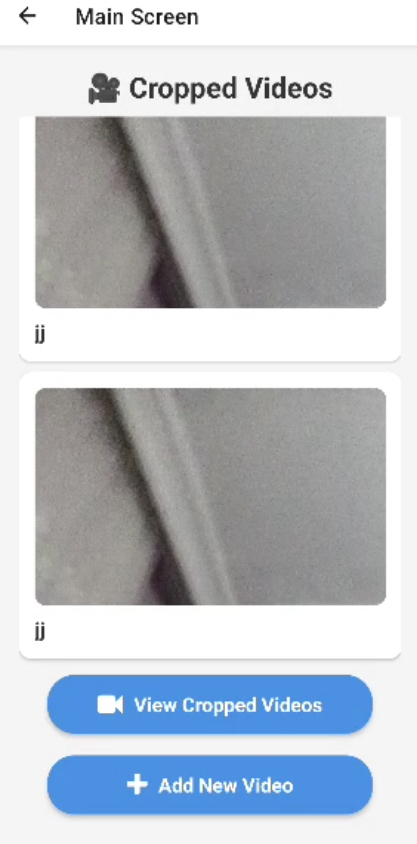
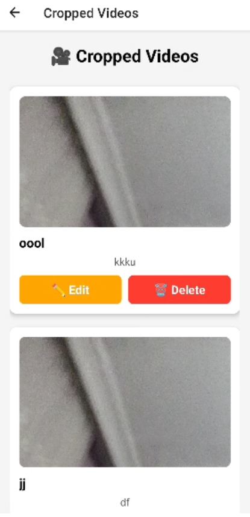
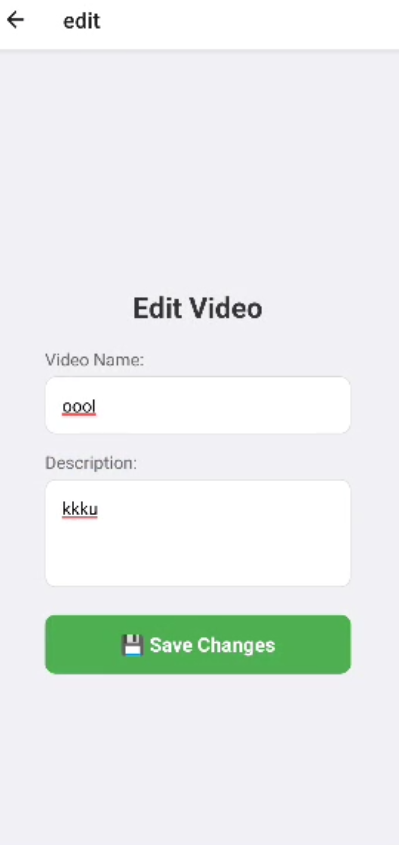
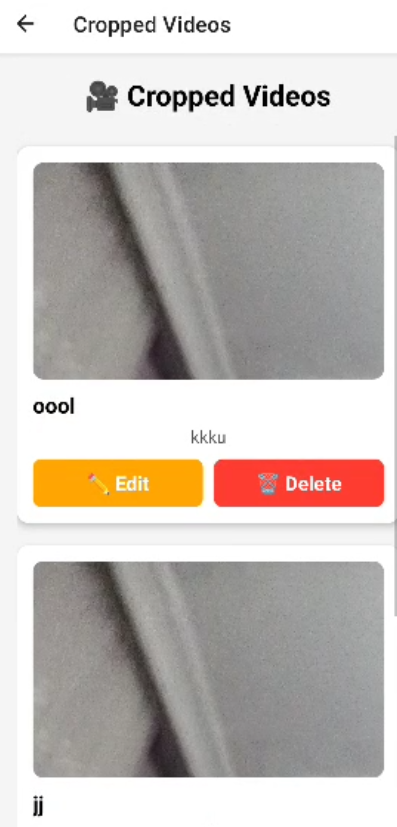
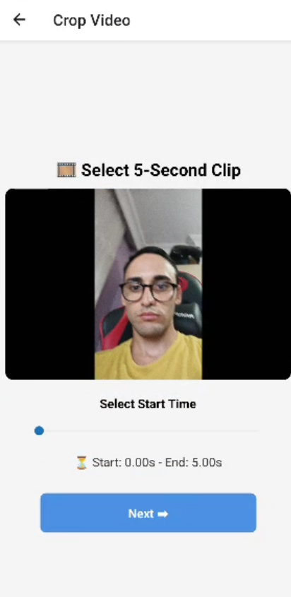

# 📹 React Native - MP4 Video Cropping Guide

This project demonstrates **how to crop the first 5 seconds of an MP4 video using Expo and FFmpeg**. Users can select a video, crop the first 5 seconds, and navigate to `crop-step3` to preview the cropped video.

---

## 📌 **1. Requirements**
Before running the project, ensure you have the following:

- **Node.js** (v16 or later)
- **Expo CLI** (If not installed: `npm install -g expo-cli`)
- **Android/iOS device or emulator** (Expo Go is not supported!)
- **Expo Dev Client**
- **FFmpeg Kit**

---

## 🚀 **2. Installation & Dependencies**

First, clone the repository:
```sh
git clone https://github.com/username/expo-video-crop.git
cd expo-video-crop
```

Install dependencies:
```sh
npm install
```

Install FFmpeg Kit and Expo Dev Client:
```sh
npm install ffmpeg-kit-react-native
npx expo install expo-dev-client
```

Run the project using Expo Dev Client:
```sh
npx expo prebuild
npx expo run:android  # For Android
npx expo run:ios     # For iOS
```

> **Note:** FFmpeg **does not work in Expo Go**! You must use **Expo Dev Client**.

---

## 📂 **3. Project Structure**
```
expo-video-crop/
│── app/
│   ├── tabs/
│   │   ├── crop.js          
│   │   ├── crop-step2.js    
│   │   ├── crop-step3.js    
│   │   ├── _layout.js    
│   │   ├── cropped-videos.js    
│   │   ├── details.js        
│   │   ├── edit.js
│   │   ├── index.js
│   │   ├── SavedVideos.js   
│   │   ├── cropped-videos.js 
│   │   ├── crop-video.js    
│── assets/
│── package.json
│── README.md
```

---

## 🎬 **4. Usage Instructions**

### 1️⃣ **Selecting a Video (crop.js)**
The user selects a video from the gallery, which is then passed to `crop-step2.js`.

```javascript
const pickVideo = async () => {
  let result = await ImagePicker.launchImageLibraryAsync({
    mediaTypes: ImagePicker.MediaTypeOptions.Videos,
    allowsEditing: false,
    quality: 1,
  });

  if (!result.canceled) {
    const selectedVideoUri = result.assets[0].uri;
    const newVideoUri = `${FileSystem.cacheDirectory}selected_video.mp4`;

    await FileSystem.copyAsync({ from: selectedVideoUri, to: newVideoUri });
    router.push(`/crop-step2?video=${encodeURIComponent(newVideoUri)}`);
  }
};
```

### 2️⃣ **Cropping the Video (crop-step2.js)**
When the user presses the **Crop** button, FFmpeg is used to **extract the first 5 seconds**.

```javascript
const cropVideo = async () => {
  setIsProcessing(true);
  const outputUri = `${FileSystem.cacheDirectory}cropped_${Date.now()}.mp4`;

  const command = `-i "${video}" -ss 0 -t 5 -c:v copy -c:a copy "${outputUri}"`;

  try {
    await FFmpegKit.execute(command).then(async (session) => {
      const returnCode = await session.getReturnCode();
      if (returnCode.isSuccess()) {
        router.push(`/crop-step3?video=${encodeURIComponent(outputUri)}`);
      } else {
        Alert.alert("Error", "Failed to crop video.");
      }
    });
  } catch (error) {
    Alert.alert("Error", "Something went wrong while cropping.");
  } finally {
    setIsProcessing(false);
  }
};
```

### 3️⃣ **Displaying the Cropped Video (crop-step3.js)**
The cropped video is displayed using the `Video` component.

```javascript
<Video source={{ uri: video }} useNativeControls resizeMode="contain" style={styles.video} />
```

---

## 🛠 **5. Troubleshooting**

### ❌ `Cannot read property 'ffmpegSession' of null`
### ❌ `FFmpeg Error: File not found`
### ❌ `Failed to load video`

---

## ✅ **6. Conclusion**
🚀 **With this project:**
- 📂 Users can **select an MP4 video**.
- ✂️ **FFmpeg extracts the first 5 seconds**.
- 🎬 **Cropped video is displayed on `crop-step3`**.

📌 **If you successfully set up the project, consider exploring more video processing features with FFmpeg!** 🚀🔥

---

## 🔗 **7. Resources**
- [FFmpeg Commands](https://ffmpeg.org/ffmpeg.html)
- [Expo Video Component](https://docs.expo.dev/versions/latest/sdk/video/)

## **8. Screen**







